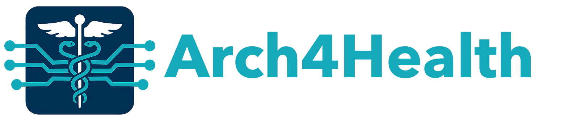

<!-- index.md -->

{: width="350px" }

**18th (Saturday) October 2025, Seoul, Korea**

**In conjunction with [the 58th IEEE/ACM International Symposium on Microarchitecture (MICRO 2025)]([https://example.com](https://microarch.org/micro58/))**

## Workshop Description

**Opportunities.** Recent biotechnological advances enable high-throughput, low-cost, and accurate biological data generation (e.g., using genome sequencing, multimodal medical imaging, continuous wearable sensing). This wealth of data enables unique opportunities for advancing healthcare. These opportunities include, but are not limited to, precision medicine, bedside personalized care, discovering early warning signs of communicable diseases, continuous physiological tracking, and enhanced diagnostic capabilities.

**Challenges.** Despite these opportunities, efficiently analyzing large-scale biological data poses significant challenges for conventional computing systems. These systems often cannot keep up with the high-throughput rate at which data is generated, and they face additional constraints related to energy efficiency, scalability, privacy, and security. High-throughput processing is particularly crucial in clinical settings, where real-time data processing can significantly impact patient outcomes by improving both response times in time-critical scenarios as well as the decision-making processes for therapeutic schemes. Therefore, to facilitate the wide adoption of recent advances in healthcare, there is a need to optimize the computing systems to enable high-performance, energy-efficient, low-cost, private, and secure analysis of biological data.

**Architecture for Health.** This workshop will focus on identifying key computational challenges in health-related applications and discussing how computer architects can contribute to advancing healthcare by addressing these challenges. First, we will provide invited talks and keynotes that summarize (i) a series of research in computing system designs for healthcare applications and (ii) new trends and bottlenecks in data-intensive healthcare applications. Second, we will invite researchers to submit their ongoing work on these topics.

**Fostering Diverse and Cross-Disciplinary Discussions.** Since cross-disciplinary discussions are crucial for better identifying challenges in real-world health-related applications, we aim to foster open discussions and cooperation between researchers with diverse backgrounds (i.e., from both computer architecture and health sciences communities, industry, and academia).

**Time & Location:** October 18th, from 01:00 PM (KST) to 05:00 PM (KST) at Lotte Hotel Seoul (Room: Charlotte).

## Call for Presentations

This workshop consists of talks on the general topic of computing system designs for healthcare applications and new trends and bottlenecks in data-intensive healthcare applications. There are a limited number of slots for talks. Attendees interested in delivering a talk on related topics should fill out a submission with an extended abstract of their talk. We invite abstract submissions related to (but not limited to) the following topics:

- Computational Biology
  - Genomics
  - Metagenomics
  - Gene editing
  - Drug Design and Discovery
  - Proteomics
  - Other Areas in Precision Medicine
- Neuroscience
  - Brain-Machine Interfaces
  - Prosthetics
- Wearable Systems for Health
- Medical robotics
  - Surgery
  - Haptics
- Mental Health
- Medical Imaging
  - Brain scans
  - Radiology
  - Single-Cell Analysis
- Agent-Based Simulations
- Medical Privacy
- Bio-Sensors

## Key Dates
- **Extended Abstract Submission Deadline:** 12 September 2025
- **Notification:** 21 September 2025
- **Workshop Date:** 18th (Saturday) October 2025

## Organizers

| Name                                                                                          | E-mail                                 |
| --------------------------------------------------------------------------------------------- | -------------------------------------- |
| [Nika Mansouri Ghiasi](https://sites.google.com/view/nikamansourighiasi/)                     | <nika.mansourighiasi@safari.ethz.ch>   |
| [Dr. Konstantina Koliogeorgi](https://ihpcs.ethz.ch/people/person-detail.MzQ0MTU2.TGlzdC8zOTQxLDc2NTU1MzE0Mg==.html) | <kkoliogeorgi@ethz.ch>  |
| [Professor Onur Mutlu](https://people.inf.ethz.ch/omutlu/)                                   | <onur.mutlu@safari.ethz.ch>            |

## Agenda & Workshop Materials

TBD

